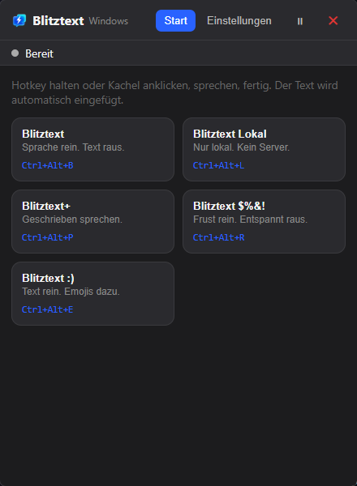
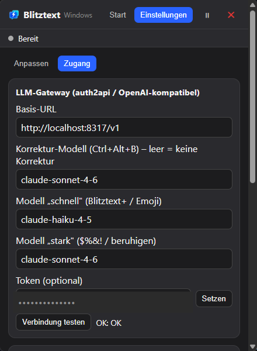
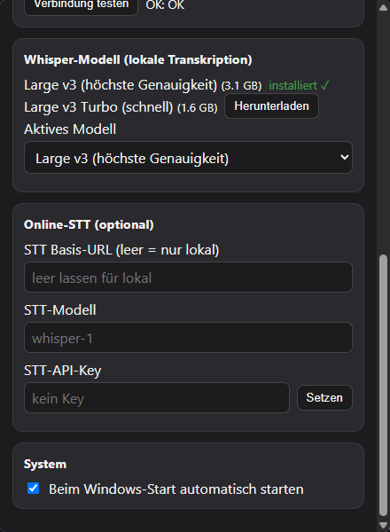

[English](README.md) · **Deutsch**

# Blitztext für Windows

Blitztext ist eine **Windows-11-Tray-App**, die Sprache in Text verwandelt: Hotkey drücken, sprechen, Text zurückbekommen, optional per KI umschreiben und automatisch in die zuvor benutzte App einfügen.

Es ist bewusst klein und „hackbar" gehalten – ein nachvollziehbarer, echter Workflow zum Anschauen und Anpassen, kein poliertes Fertigprodukt.

## Herkunft / Basiert auf

> [!IMPORTANT]
> **Dieses Projekt ist eine Portierung** der ursprünglichen **macOS-App „Blitztext"** von **cmagnussen**: <https://github.com/cmagnussen/blitztext-app>.
>
> Die gesamte Idee, die Workflows und die KI-Prompts stammen aus diesem Original (veröffentlicht unter **MIT**). Dieses Repository enthält die eigenständige **Windows-Portierung**; der macOS-Originalcode liegt im [Original-Repository](https://github.com/cmagnussen/blitztext-app). Dank an das Original-Projekt.

## Danksagung & Credits

Dieses Projekt steht auf den Schultern von zwei großartigen Vorarbeiten:

- 🎙️ **Blitztext (Original, macOS)** von **cmagnussen** – Idee, Workflows und Prompts: <https://github.com/cmagnussen/blitztext-app>
- 🔌 **auth2api** von **Marc Meese** – der eigentliche Schlüssel zur Flexibilität: <https://community.marcmeese.de/freebie/auth2api> (Docker-Image: `ranktotop/auth2api`)

> [!IMPORTANT]
> **Ohne auth2api gäbe es diese Flexibilität nicht.** auth2api stellt ein **vorhandenes Abo (z. B. Claude Max) als OpenAI-kompatible API** bereit – dadurch laufen die KI-Workflows hier **ohne zusätzliche Token-Kosten** über deinen bestehenden Account. Großen Dank an Marc Meese für dieses Tool! 🙏

> [!WARNING]
> **Nutzung auf eigene Gefahr.** Der programmatische Zugriff auf ein Consumer-Abo (z. B. Claude Max) über einen Proxy wie auth2api **kann den Nutzungsbedingungen des jeweiligen Anbieters widersprechen** und dein Konto gefährden. Ob und wie du einen solchen Proxy einsetzt, liegt in **deiner eigenen Verantwortung** – prüfe die Bedingungen des Anbieters, den du anbindest. Blitztext selbst ist anbieterneutral: Es spricht nur einen OpenAI-kompatiblen Endpunkt an und benötigt auth2api **nicht** (nutze stattdessen einen regulären API-Key, Ollama oder einen anderen kompatiblen Endpunkt).

## Was wurde geändert – und warum

Das macOS-Binary lässt sich **nicht** unter Windows ausführen (es baut auf macOS-Frameworks wie AppKit, CoreML/WhisperKit, Keychain). Die Windows-Version ist daher eine **Neuimplementierung mit identischem Verhalten**:

| Bereich | Original (macOS) | Windows-Portierung | Warum |
|---|---|---|---|
| Technik | Swift / SwiftUI | **Tauri (Rust + SvelteKit)** | Läuft nativ unter Windows, schlankes Binary |
| Transkription | WhisperKit / CoreML | **whisper.cpp (`large-v3`)** | CoreML gibt es nur auf dem Mac |
| KI-Umschreiben | fest OpenAI | **konfigurierbarer OpenAI-kompatibler Endpunkt** | Nutzung vorhandener Abos via Proxy (z. B. auth2api/Claude), Ollama oder OpenAI – ohne Code-Änderung |
| Hotkeys | `fn` + Modifier (fest) | **frei konfigurierbar** (Strg/Alt/…) | Die `fn`-Taste gibt es unter Windows nicht |
| Auto-Paste | CGEvent + Accessibility | **Strg+V via SendInput** | Unter Windows ohne Sonderrechte möglich |
| Geheimnisse | macOS Keychain | **Windows Credential Manager** | Plattform-Äquivalent |
| Autostart | SMAppService | **Registry-`Run` (tauri-plugin-autostart)** | Plattform-Äquivalent |

## Funktionen

- **Blitztext** (`Strg+Alt+B`): aufnehmen → lokal transkribieren → optional leichte KI-Korrektur (Zeichensetzung/Tippfehler) → einfügen.
- **Blitztext Lokal** (`Strg+Alt+L`): wie oben, aber **rein lokal/offline** (keine Cloud).
- **Blitztext+** (`Strg+Alt+P`): aufnehmen → transkribieren → Text sauberer formulieren (Ton wählbar).
- **Blitztext $%&!** (`Strg+Alt+R`): frustriert eingesprochenen Text in eine ruhige Nachricht umwandeln.
- **Blitztext :)** (`Strg+Alt+E`): passende Emojis in den diktierten Text einfügen.

Hotkeys sind in den Einstellungen frei belegbar; **Halten**- oder **Drücken/Toggle**-Modus.

### Bedienung

- **Tray-Icon** (unten rechts, ggf. im Überlauf „^"): Linksklick öffnet/schließt das Fenster; Rechtsklick öffnet das Menü (Öffnen, Einstellungen, Pausieren/Aktivieren, Beenden).
- **✕** im Fenster blendet ins Tray (die App läuft im Hintergrund weiter).
- **Pausieren** (Header-Schalter oder Tray): meldet alle globalen Hotkeys ab, ohne die App zu beenden. Das **Tray-Icon ist farbig = aktiv, grau = pausiert**.
- **Beenden** nur über Tray → **Beenden**.

## Screenshots

Das Hauptfenster — Hotkey einer Kachel halten (oder die Kachel anklicken), sprechen, der Text wird automatisch eingefügt:



**Einstellungen → Zugang** — der OpenAI-kompatible LLM-Gateway (z. B. auth2api): Basis-URL, die Korrektur-/Schnell-/Stark-Modelle und ein optionales Token mit „Verbindung testen":



**Einstellungen** — lokales Whisper-Modell herunterladen/auswählen, optional einen Online-STT-Endpunkt einrichten und Autostart umschalten:



## Installation

Fertige Installer gibt es im [GitHub-Release](https://github.com/Kjeld76/blitztext-app/releases) – in **zwei Varianten**:

- **CPU** (`Blitztext_<version>_x64-cpu-setup.exe`): universell, klein, läuft auf jedem x64-Windows. Empfohlen **ohne** NVIDIA-GPU.
- **CUDA/GPU** (`Blitztext_<version>_x64-cuda-setup.exe`): mit NVIDIA-GPU-Beschleunigung (`large-v3` läuft deutlich schneller). Enthält die nötige CUDA-Runtime – ein **separates CUDA-Toolkit ist nicht erforderlich**. Empfohlen **mit** NVIDIA-GPU (Turing oder neuer).

Beide jeweils auch als `.msi`. Nach der Installation beim ersten Start das Whisper-Modell in den Einstellungen herunterladen. Die Installer sind nicht signiert – Windows SmartScreen kann beim ersten Start warnen („Weitere Informationen" → „Trotzdem ausführen").

## Systemvoraussetzungen (Nutzung)

| | Minimum | Empfohlen |
|---|---|---|
| **Betriebssystem** | Windows 10 64-bit (21H2) | Windows 11 |
| **Architektur** | x64 | x64 (kein ARM64-Build) |
| **Arbeitsspeicher** | 8 GB | 16 GB (`large-v3` belegt ~3 GB) |
| **Festplatte** | ~150 MB App + **~3,1 GB** für das Modell `large-v3` (Download in der App) | zzgl. temporäre Audiodaten |
| **Mikrofon** | erforderlich | — |

**GPU (optional, nur CUDA-Installer):** NVIDIA mit CUDA Compute Capability **≥ 7.5** (Turing oder neuer: GTX 16xx, RTX 20xx / 30xx / 40xx / 50xx, RTX PRO / Blackwell), **~4 GB freier VRAM** für `large-v3` (sonst `large-v3-turbo` oder CPU), aktueller NVIDIA-Treiber (für Blackwell/`sm_120` mit CUDA-13-Unterstützung). Die CUDA-Runtime-Bibliotheken sind im CUDA-Installer enthalten.

**Ohne passende NVIDIA-GPU:** der **CPU-Installer** läuft überall (auch AMD/Intel/ohne GPU), nur langsamer.

## Wichtige Hinweise (Preview)

- Diese Version ist für **Windows 11**; die macOS-Variante findet sich im [Original-Repository](https://github.com/cmagnussen/blitztext-app).
- **Eigene Zugänge mitbringen:** Die Spracherkennung läuft lokal (kostenlos). Für die KI-Umschreibung brauchst du einen **OpenAI-kompatiblen Endpunkt** (z. B. einen eigenen auth2api-Proxy, Ollama oder einen OpenAI-Key).
- **Kein gehostetes Backend.** Im Online-Fall gehen Daten direkt von deinem Rechner an den von dir konfigurierten Endpunkt.
- Lern- und Experimentierprojekt, **nicht produktionsreif**, ohne Gewähr und ohne Support-Garantie.

## Voraussetzungen (Entwicklung / Bauen aus dem Quellcode)

> Nur nötig, wenn du selbst baust. Für die reine Nutzung siehe **Installation** oben.

- **Windows 11**
- **Rust** (stable, MSVC) + **VC++ Build Tools 2022**
- **Node ≥ 20** und **pnpm**
- **CMake** (für whisper.cpp) und **libclang** (für `whisper-rs`/bindgen; z. B. via `winget install LLVM.LLVM`, dann `LIBCLANG_PATH` setzen)
- Für die KI-Workflows: ein **OpenAI-kompatibler Endpunkt** (Basis-URL + Modell + ggf. Token)
- Für lokale Transkription: das Whisper-Modell `large-v3` (Download direkt in der App)

## Bauen & Starten

```powershell
git clone https://github.com/Kjeld76/blitztext-app.git
cd blitztext-app
pnpm install
pnpm tauri dev          # App im Tray starten (Entwicklung)
pnpm tauri build        # MSI/NSIS-Installer bauen
```

GPU-Beschleunigung (NVIDIA/CUDA) optional: `pnpm tauri build --features cuda` (aktiviert zugleich Beam-Search für höhere Genauigkeit). Zum **Bauen** wird das CUDA-Toolkit (13.x) benötigt; die Ziel-Architekturen werden über `CMAKE_CUDA_ARCHITECTURES` in der lokalen `src-tauri/.cargo/config.toml` gesetzt (z. B. `75-real;86-real;89-real;120-real;75-virtual` für Turing–Blackwell). Die **fertigen CUDA-Installer** bringen die CUDA-Runtime selbst mit – Endnutzer brauchen kein Toolkit. Zum Bündeln die Runtime-DLLs (`cudart64_13.dll`, `cublas64_13.dll`, `cublasLt64_13.dll`, aus `bin\x64` des Toolkits) nach `src-tauri/cuda-redist/` legen (gitignored) und mit `pnpm tauri build --features cuda --config src-tauri/tauri.cuda.conf.json` bauen – die Merge-Konfiguration installiert sie neben die EXE.

> Immer über die **Tauri-CLI** bauen (`pnpm tauri …`), **nicht** über nacktes `cargo build` – sonst erwartet die App den Dev-Server auf `localhost:1420`.

Beim ersten Start: in **Einstellungen → Zugang** den LLM-Gateway (Basis-URL/Modell/Token) eintragen und das Whisper-Modell herunterladen.

## Berechtigungen

- **Mikrofon**: zum Aufnehmen deiner Stimme. Falls nach dem Sprechen kein Text kommt: *Windows-Einstellungen → Datenschutz → Mikrofon → „Desktop-Apps Zugriff erlauben"*.
- Eine separate Accessibility-Freigabe wie unter macOS ist **nicht nötig** – das Einfügen erfolgt per simuliertem Strg+V.

## Datenfluss

```text
Transkription (Standard): dein PC -> lokales whisper.cpp (large-v3)
KI-Umschreiben:           dein PC -> dein OpenAI-kompatibler Endpunkt (z. B. auth2api -> Claude)
Transkription (optional): dein PC -> externer OpenAI-kompatibler STT-Dienst (nur falls konfiguriert)
```

Kein gehostetes Blitztext-Backend. Der Zugangs-Token liegt im **Windows Credential Manager**, Einstellungen in `%APPDATA%\Blitztext\settings.json`, Modelle in `%APPDATA%\Blitztext\models\`.

## Projektstruktur

```text
src-tauri/         Rust-Backend (Audio, Whisper, LLM-Gateway, Hotkeys, Tray, Autostart)
src/               SvelteKit-UI (Workflow-Kacheln, Einstellungen)
static/            Statische Assets
docs/Projektstatus.md   Ausführlicher Statusbericht
CHANGELOG.md       Änderungshistorie
THIRD-PARTY-NOTICES.md  Drittanbieter-Lizenzen (u. a. gebündelte NVIDIA-CUDA-Runtime)
```

## Lokale Modelle

Die lokale Transkription nutzt whisper.cpp. Die App bündelt kein Modell – in den Einstellungen `large-v3` (höchste Genauigkeit) auswählen und herunterladen. Mit GPU/CUDA läuft es deutlich schneller.

## Mitwirken

Beiträge sind willkommen, besonders wenn sie das Bauen, Verstehen oder Forken erleichtern. Siehe [CONTRIBUTING.de.md](CONTRIBUTING.de.md).

## Lizenz

Code unter der **MIT-Lizenz** – siehe [LICENSE](LICENSE). Diese Windows-Portierung übernimmt die Lizenz des Originals (cmagnussen/blitztext-app).

Projektnamen, Logos und App-Icons sind damit nicht automatisch als Marken/Brand-Assets freigegeben – siehe [TRADEMARKS.md](TRADEMARKS.md).

## Rechtliches / Impressum & Datenschutz

Experimentelles, nicht-kommerzielles Open-Source-Projekt, „as is" unter MIT, ohne Gewähr oder Support. Es wird nichts verkauft und nichts in deinem Auftrag installiert oder betrieben.

Die Begleit-Website (blitztext.de) des Originals wird von der Blackboat Internet GmbH betrieben:

- Impressum: <https://www.blackboat.com/impressum>
- Datenschutz: <https://www.blackboat.com/datenschutz>
